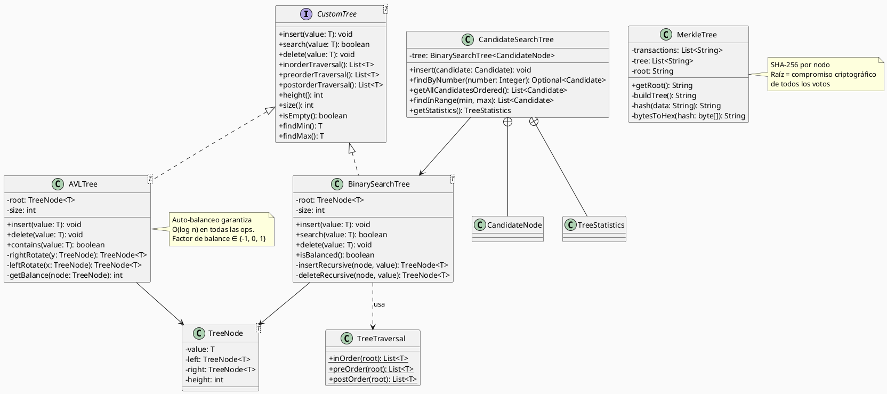
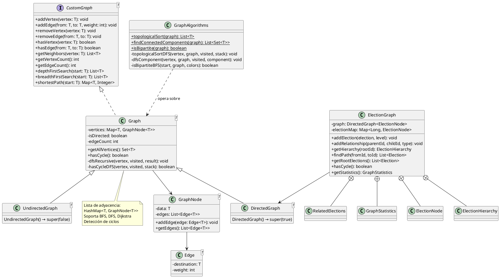
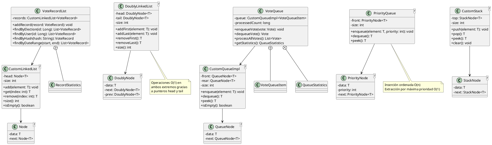
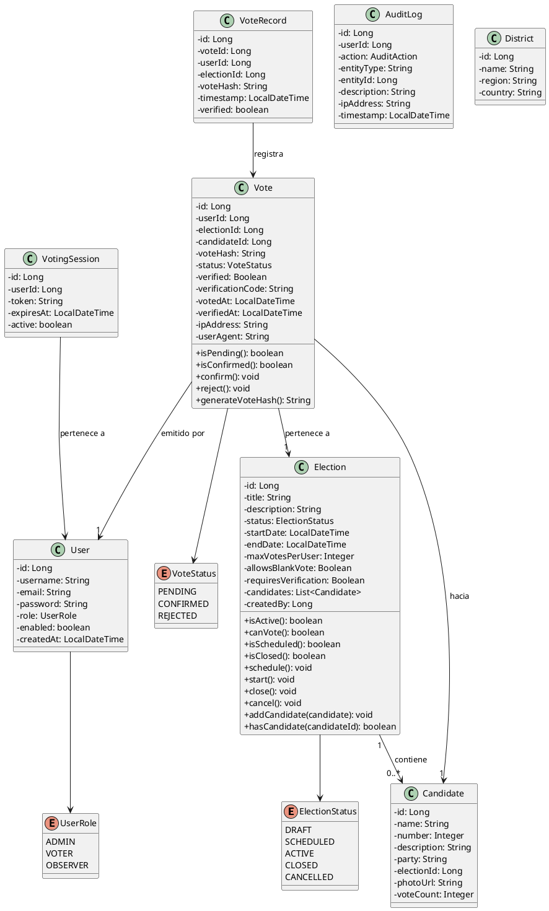
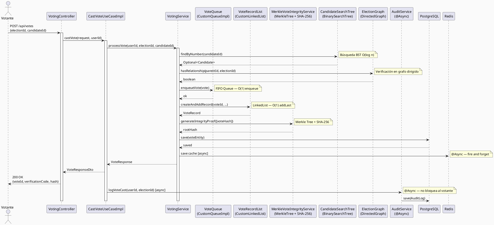
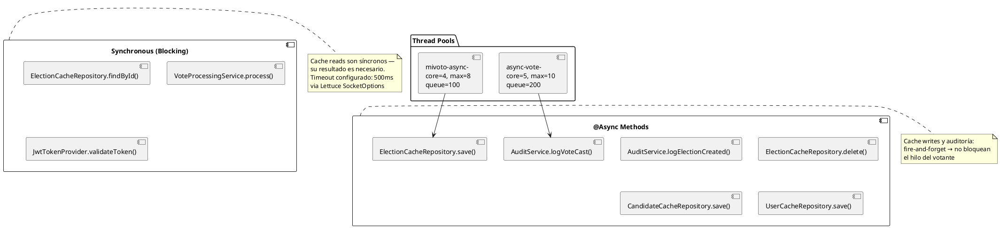

# Reporte Técnico: Mivoto Service — Algoritmos, Estructuras de Datos y POO

> **Proyecto:** Sistema de Votación Electrónica (Mivoto)
> **Tecnología:** Java 17 + Spring Boot 3.2.1
> **Arquitectura:** Hexagonal (Ports & Adapters)
> **Base de datos:** PostgreSQL + Redis (caché)

---

## Tabla de Contenidos

1. [Estructura del Proyecto](#1-estructura-del-proyecto)
2. [Arquitectura y Principios de POO](#2-arquitectura-y-principios-de-poo)
3. [Patrones de Diseño](#3-patrones-de-diseño)
4. [Estructuras de Datos Implementadas](#4-estructuras-de-datos-implementadas)
5. [Algoritmos Implementados](#5-algoritmos-implementados)
6. [Diagrama de Clases — Estructuras de Datos](#6-diagrama-de-clases--estructuras-de-datos)
7. [Diagrama de Arquitectura Hexagonal](#7-diagrama-de-arquitectura-hexagonal)
8. [Diagrama de Entidades de Dominio](#8-diagrama-de-entidades-de-dominio)
9. [Flujo de Procesamiento de Votos](#9-flujo-de-procesamiento-de-votos)
10. [Análisis de Complejidad](#10-análisis-de-complejidad)
11. [Concurrencia y Asincronismo](#11-concurrencia-y-asincronismo)

---

## 1. Estructura del Proyecto

```
src/main/java/pe/com/mivoto/service/
├── MivotoServiceMonoApplication.java
│
├── domain/                          ← Núcleo del dominio (sin dependencias externas)
│   ├── model/                       ← Entidades de dominio
│   │   ├── Election.java
│   │   ├── Candidate.java
│   │   ├── Vote.java
│   │   ├── VoteRecord.java
│   │   ├── VotingSession.java
│   │   ├── User.java
│   │   ├── AuditLog.java
│   │   └── District.java
│   ├── enums/
│   │   ├── ElectionStatus.java      ← DRAFT, SCHEDULED, ACTIVE, CLOSED, CANCELLED
│   │   ├── VoteStatus.java          ← PENDING, CONFIRMED, REJECTED
│   │   ├── UserRole.java
│   │   └── AuditAction.java
│   ├── exceptions/                  ← Excepciones de dominio tipadas
│   └── ports/
│       ├── in/                      ← Casos de uso (interfaces de entrada)
│       │   ├── AuthUseCase.java
│       │   ├── ElectionUseCase.java
│       │   ├── VotingUseCase.java
│       │   ├── CandidateUseCase.java
│       │   └── AuditUseCase.java
│       └── out/                     ← Puertos de salida (repositorios/servicios)
│           ├── ElectionRepository.java
│           ├── VoteRepository.java
│           ├── UserRepository.java
│           ├── CandidateRepository.java
│           ├── AuditRepository.java
│           ├── SessionRepository.java
│           ├── DistrictRepository.java
│           └── VoteIntegrityService.java
│
├── application/                     ← Lógica de aplicación
│   ├── services/                    ← Servicios orquestadores
│   │   ├── AuditService.java
│   │   ├── AuthenticationService.java
│   │   ├── CandidateService.java
│   │   ├── ElectionManagementService.java
│   │   ├── MerkleVoteIntegrityService.java  ← Árbol de Merkle
│   │   ├── StatisticsService.java
│   │   ├── VoteProcessingService.java
│   │   └── VotingService.java
│   └── usecases/                    ← Implementaciones de casos de uso
│       ├── audit/, auth/, election/
│       ├── user/, voting/
│
├── datastructures/                  ← Estructuras de datos personalizadas
│   ├── interfaces/
│   │   ├── CustomTree.java          ← Contrato para árboles binarios
│   │   ├── CustomGraph.java         ← Contrato para grafos
│   │   ├── CustomList.java
│   │   └── CustomQueue.java
│   ├── linear/
│   │   ├── linkedlist/
│   │   │   ├── Node.java            ← Nodo singly linked list
│   │   │   ├── CustomLinkedList.java
│   │   │   ├── DoublyNode.java      ← Nodo doubly linked list
│   │   │   └── DoublyLinkedList.java
│   │   ├── queue/
│   │   │   ├── QueueNode.java
│   │   │   ├── CustomQueueImpl.java ← Cola FIFO
│   │   │   ├── PriorityNode.java
│   │   │   └── PriorityQueue.java   ← Cola con prioridad
│   │   └── stack/
│   │       ├── StackNode.java
│   │       └── CustomStack.java     ← Pila LIFO
│   ├── nonlinear/
│   │   ├── tree/
│   │   │   ├── TreeNode.java
│   │   │   ├── BinarySearchTree.java  ← BST genérico
│   │   │   ├── AVLTree.java           ← BST auto-balanceado
│   │   │   ├── MerkleTree.java        ← Árbol hash SHA-256
│   │   │   └── TreeTraversal.java     ← Recorridos in/pre/post-order
│   │   └── graph/
│   │       ├── GraphNode.java
│   │       ├── Edge.java
│   │       ├── Graph.java             ← Grafo genérico (lista de adyacencia)
│   │       ├── DirectedGraph.java     ← Grafo dirigido
│   │       ├── UndirectedGraph.java   ← Grafo no dirigido
│   │       └── GraphAlgorithms.java   ← BFS bipartito, DFS componentes, toposort
│   └── implementations/             ← Wrappers de dominio sobre estructuras
│       ├── CandidateSearchTree.java  ← BST para candidatos
│       ├── ElectionGraph.java        ← Grafo dirigido para elecciones
│       ├── VoteQueue.java            ← Cola FIFO para votos pendientes
│       └── VoteRecordList.java       ← Lista enlazada para historial
│
├── infrastructure/                  ← Adaptadores externos
│   ├── config/
│   ├── persistence/
│   │   ├── adapters/                ← Implementan puertos de dominio
│   │   ├── entities/                ← Entidades JPA
│   │   ├── mappers/                 ← Conversión entidad ↔ dominio
│   │   ├── redis/                   ← Repositorios de caché
│   │   └── repositories/           ← Interfaces Spring Data JPA
│   └── security/
│       └── jwt/
│
└── presentation/                    ← Controladores REST + DTOs
    ├── controllers/
    ├── dto/request/, dto/response/
    ├── exception/
    └── mappers/
```

---

## 2. Arquitectura y Principios de POO

### 2.1 Arquitectura Hexagonal (Ports & Adapters)

El proyecto implementa **Arquitectura Hexagonal**, que garantiza que el dominio de negocio no tenga dependencias externas. Las interfaces del dominio definen contratos que los adaptadores implementan.

| Capa | Rol |
|------|-----|
| **Domain** | Entidades puras, reglas de negocio, interfaces (puertos) |
| **Application** | Orquestación de casos de uso, servicios |
| **Infrastructure** | Adaptadores: JPA, Redis, JWT, configs |
| **Presentation** | API REST: controladores, DTOs |

### 2.2 Principios SOLID aplicados

| Principio | Aplicación en el proyecto |
|-----------|--------------------------|
| **S** — Single Responsibility | Cada clase tiene una única responsabilidad: `CandidateSearchTree` solo gestiona la búsqueda, `MerkleVoteIntegrityService` solo verifica integridad |
| **O** — Open/Closed | `Graph<T>` está abierto para extensión (`DirectedGraph`, `UndirectedGraph`) y cerrado para modificación |
| **L** — Liskov Substitution | `DirectedGraph` y `UndirectedGraph` son intercambiables como `Graph<T>` |
| **I** — Interface Segregation | Puertos separados: `ElectionRepository`, `VoteRepository`, `UserRepository` — no un repositorio gigante |
| **D** — Dependency Inversion | Los servicios dependen de puertos (`ElectionRepository` interfaz), nunca de adaptadores concretos |

### 2.3 Los 4 Pilares de POO

#### Encapsulamiento
```java
// CandidateSearchTree.java
private final BinarySearchTree<CandidateNode> tree; // estado interno oculto

public Optional<Candidate> findByNumber(Integer number) { ... } // API pública limpia
public void insert(Candidate candidate) { ... }
```

#### Herencia
```java
// DirectedGraph.java
public class DirectedGraph<T> extends Graph<T> {
    public DirectedGraph() { super(true); } // reutiliza toda la lógica del padre
}

// UndirectedGraph.java
public class UndirectedGraph<T> extends Graph<T> {
    public UndirectedGraph() { super(false); }
}
```

Todas las excepciones de dominio heredan de `RuntimeException`:
- `AuthenticationException`
- `DuplicateVoteException`
- `ElectionNotFoundException`
- `InvalidElectionException`
- `UserNotFoundException`
- `VotingException`

#### Polimorfismo
```java
// Mismo contrato CustomTree<T>, dos implementaciones intercambiables
CustomTree<Integer> bst = new BinarySearchTree<>();
CustomTree<Integer> avl = new AVLTree<>();

bst.insert(10); avl.insert(10);  // misma interfaz, distinto comportamiento interno
```

#### Abstracción
```java
// Puerto de dominio (abstracción pura)
public interface VoteIntegrityService {
    String generateIntegrityProof(List<String> voteHashes);
    boolean verifyIntegrity(List<String> voteHashes, String rootHash);
}

// Implementación concreta oculta detrás de la abstracción
@Service
public class MerkleVoteIntegrityService implements VoteIntegrityService {
    // usa MerkleTree internamente — el cliente no lo sabe
}
```

### 2.4 Uso de Genéricos

Todas las estructuras de datos personalizadas son **genéricas**, permitiendo reutilización con cualquier tipo:

```java
public class BinarySearchTree<T extends Comparable<T>> implements CustomTree<T>
public class AVLTree<T extends Comparable<T>> implements CustomTree<T>
public class Graph<T> implements CustomGraph<T>
public class CustomStack<T>
public class DoublyLinkedList<T>
public class PriorityQueue<T>
```

---

## 3. Patrones de Diseño

### 3.1 Repository Pattern
Los puertos de salida del dominio actúan como repositorios abstractos. Los adaptadores de infraestructura los implementan contra JPA o Redis.

```
ElectionRepository (interfaz de dominio)
    └── ElectionRepositoryAdapter (@Repository, implementa interfaz)
            ├── JpaElectionRepository (Spring Data JPA)
            └── ElectionCacheRepository (Redis)
```

### 3.2 Adapter Pattern
Cada `XxxRepositoryAdapter` adapta la interfaz de dominio al sistema de persistencia:

```
domain port: ElectionRepository.findById(Long id)
           ↓
adapter:   ElectionRepositoryAdapter.findById(Long id)
               → cacheRepo.findById(id)  [Redis]
               → jpaRepo.findById(id)    [PostgreSQL]
               → mapper.toDomain(entity)
```

### 3.3 Builder Pattern
Todos los modelos de dominio usan el patrón Builder via Lombok `@Builder`:

```java
VoteRecord record = VoteRecord.builder()
    .voteId(voteId)
    .userId(userId)
    .electionId(electionId)
    .voteHash(voteHash)
    .timestamp(LocalDateTime.now())
    .verified(false)
    .build();
```

### 3.4 Template Method Pattern
`Graph<T>` define el algoritmo general, y las subclases especializan solo el tipo de grafo:

```java
// Graph.java — define todo el comportamiento
public void addEdge(T from, T to, int weight) {
    ...
    if (!isDirected) { // comportamiento varía según bandera interna
        toNode.addEdge(new Edge<>(from, weight));
    }
}
// DirectedGraph / UndirectedGraph solo pasan el flag al constructor
```

### 3.5 Wrapper / Decorator Pattern
Las implementaciones de dominio envuelven estructuras genéricas añadiendo semántica de negocio:

| Wrapper | Estructura subyacente | Propósito |
|---------|----------------------|-----------|
| `CandidateSearchTree` | `BinarySearchTree<CandidateNode>` | Búsqueda de candidatos por número |
| `ElectionGraph` | `DirectedGraph<ElectionNode>` | Jerarquía de elecciones |
| `VoteQueue` | `CustomQueueImpl<VoteQueueItem>` | Buffer de votos a procesar |
| `VoteRecordList` | `CustomLinkedList<VoteRecord>` | Historial de votos en memoria |

### 3.6 Strategy Pattern
La interfaz `CustomTree<T>` permite intercambiar BST por AVL sin cambiar el código cliente:

```java
// CandidateService puede usar cualquier CustomTree<CandidateNode>
private final BinarySearchTree<CandidateNode> tree; // actualmente BST, intercambiable con AVL
```

---

## 4. Estructuras de Datos Implementadas

### 4.1 Estructuras Lineales

#### Singly Linked List — `CustomLinkedList<T>`
- Nodos: `Node<T>` con referencia `next`
- Operaciones: `add`, `get(index)`, `remove`, `size`, `isEmpty`
- **Uso en el proyecto:** base de `VoteRecordList`

#### Doubly Linked List — `DoublyLinkedList<T>`
- Nodos: `DoublyNode<T>` con referencias `next` y `prev`
- Operaciones: `addFirst`, `addLast`, `removeFirst`, `removeLast`
- Mantiene punteros `head` y `tail` para O(1) en ambos extremos

#### Cola FIFO — `CustomQueueImpl<T>`
- Implementación con lista enlazada interna
- Operaciones: `enqueue`, `dequeue`, `peek`, `isEmpty`, `size`
- **Uso en el proyecto:** base de `VoteQueue`

#### Cola con Prioridad — `PriorityQueue<T>`
- Nodos: `PriorityNode<T>` con campo `priority`
- Inserción ordenada: O(n) — mantiene lista siempre ordenada por prioridad descendente
- **Principio:** mayor prioridad sale primero (max-priority queue)

#### Pila LIFO — `CustomStack<T>`
- Implementación con nodos enlazados (`StackNode<T>`)
- Operaciones: `push`, `pop`, `peek`, `clear`, `toString`
- **Uso en el proyecto:** empleada en el algoritmo de ordenamiento topológico

### 4.2 Estructuras No Lineales — Árboles

#### Binary Search Tree (BST) — `BinarySearchTree<T>`
- Nodos: `TreeNode<T>` con `value`, `left`, `right`, `height`
- Propiedad: `izquierda < nodo < derecha`
- Operaciones: `insert`, `search`, `delete`, `findMin`, `findMax`, `isBalanced`
- Recorridos delegados a `TreeTraversal` (in-order, pre-order, post-order)
- **Uso:** base de `CandidateSearchTree`

#### AVL Tree — `AVLTree<T>`
- Árbol BST **auto-balanceado** (Adelson-Velsky and Landis, 1962)
- Factor de balance: `height(left) - height(right)` debe estar en `{-1, 0, 1}`
- Rotaciones implementadas: **izquierda**, **derecha**, **izquierda-derecha**, **derecha-izquierda**
- Implementa la misma interfaz `CustomTree<T>` que el BST
- Garantiza O(log n) en insert, search y delete

#### Merkle Tree — `MerkleTree`
- Árbol de hashes construido de abajo hacia arriba
- Cada hoja = SHA-256 del voto individual
- Cada nodo interno = SHA-256 de la concatenación de sus dos hijos
- La raíz (`root`) es el **compromiso criptográfico** de todos los votos
- Si el número de nodos es impar, el último nodo se duplica
- **Uso:** `MerkleVoteIntegrityService` para generar y verificar integridad de bloques de votos

### 4.3 Estructuras No Lineales — Grafos

#### Grafo Genérico — `Graph<T>`
- **Representación:** Lista de adyacencia usando `HashMap<T, GraphNode<T>>`
- Soporta grafos **dirigidos y no dirigidos** (flag `isDirected`)
- Aristas con peso: `Edge<T>` con `destination` y `weight`
- Operaciones: `addVertex`, `addEdge`, `removeVertex`, `removeEdge`, `hasVertex`, `hasEdge`, `getNeighbors`
- Traversales incorporados: `depthFirstSearch`, `breadthFirstSearch`, `shortestPath` (Dijkstra)
- Detección de ciclos: `hasCycle()`

#### DirectedGraph / UndirectedGraph
- Subclases especializadas de `Graph<T>`
- `DirectedGraph<T>`: aristas unidireccionales (A → B no implica B → A)
- `UndirectedGraph<T>`: aristas bidireccionales (A ↔ B)

### 4.4 Estructuras de la Biblioteca Estándar (Java)

| Estructura | Clase Java | Uso en el proyecto |
|-----------|-----------|-------------------|
| HashMap | `java.util.HashMap` | Lista de adyacencia del grafo, `electionMap` en `ElectionGraph` |
| HashSet | `java.util.HashSet` | Conjuntos de vértices visitados en DFS/BFS |
| ArrayList | `java.util.ArrayList` | Resultados de traversales, listas de vecinos |
| LinkedList | `java.util.LinkedList` | Cola interna en BFS (`Queue<T>`) |
| PriorityQueue | `java.util.PriorityQueue` | Cola de prioridad en Dijkstra (con `Comparator`) |
| Stack | `java.util.Stack` | Pila en ordenamiento topológico |

---

## 5. Algoritmos Implementados

### 5.1 Búsqueda en Árbol Binario (BST Search)
**Archivo:** `BinarySearchTree.java:73-98` y `AVLTree.java:180-199`

```
Algoritmo: Búsqueda BST (recursiva)
  Entrada: nodo raíz, valor buscado
  Si nodo == null → retorna false
  Si valor == nodo.value → retorna true
  Si valor < nodo.value → busca en subárbol izquierdo
  Si valor > nodo.value → busca en subárbol derecho
```
- **Complejidad:** O(log n) promedio, O(n) peor caso (árbol degenerado)
- **Con AVL:** garantizado O(log n)

### 5.2 Rotaciones AVL (Auto-Balanceo)
**Archivo:** `AVLTree.java:335-365`

El árbol calcula el **factor de balance** de cada nodo tras insertar/eliminar y aplica rotaciones:

| Caso | Condición | Rotación |
|------|-----------|----------|
| LL | balance > 1 y valor < hijo_izq.valor | Simple derecha |
| RR | balance < -1 y valor > hijo_der.valor | Simple izquierda |
| LR | balance > 1 y valor > hijo_izq.valor | Doble: izq en hijo, der en raíz |
| RL | balance < -1 y valor < hijo_der.valor | Doble: der en hijo, izq en raíz |

### 5.3 Recorridos de Árbol (Tree Traversals)
**Archivo:** `TreeTraversal.java`, `BinarySearchTree.java`

| Recorrido | Orden | Resultado en BST |
|-----------|-------|-----------------|
| **In-order** (LNR) | Izquierda → Raíz → Derecha | Elementos en orden ascendente |
| **Pre-order** (NLR) | Raíz → Izquierda → Derecha | Útil para copiar/serializar árbol |
| **Post-order** (LRN) | Izquierda → Derecha → Raíz | Útil para eliminar árbol |

**Uso en dominio:** `CandidateSearchTree.getAllCandidatesOrdered()` usa in-order para obtener candidatos ordenados por número.

### 5.4 Búsqueda en Profundidad — DFS
**Archivo:** `Graph.java:218-248`

```
Algoritmo: DFS (recursivo)
  Entrada: vértice inicial
  Marcar vértice como visitado
  Para cada vecino no visitado:
    Llamar DFS(vecino) recursivamente
```
- **Complejidad:** O(V + E) donde V = vértices, E = aristas
- **Usos:** `ElectionGraph.getHierarchy()` para obtener estructura jerárquica; detección de ciclos; componentes conectadas

### 5.5 Búsqueda en Anchura — BFS
**Archivo:** `Graph.java:257-284` y `GraphAlgorithms.java:127-147`

```
Algoritmo: BFS (iterativo con cola)
  Entrada: vértice inicial
  Encolar vértice inicial, marcarlo visitado
  Mientras cola no vacía:
    Desencolar vértice actual
    Para cada vecino no visitado:
      Marcar como visitado, encolar
```
- **Complejidad:** O(V + E)
- **Usos:** verificación de grafos bipartitos; encontrar camino más corto sin pesos

### 5.6 Algoritmo de Dijkstra (Camino Más Corto)
**Archivo:** `Graph.java:296-335`

```
Algoritmo: Dijkstra
  Entrada: vértice origen
  Distancias[todos] = ∞, Distancias[origen] = 0
  Cola de prioridad con (origen, 0)
  Mientras cola no vacía:
    (u, dist_u) = extraer mínimo de la cola
    Si u ya visitado → continuar
    Para cada arista (u, v, peso):
      nueva_dist = dist_u + peso
      Si nueva_dist < Distancias[v]:
        Distancias[v] = nueva_dist
        Encolar (v, nueva_dist)
```
- **Complejidad:** O((V + E) log V) con cola de prioridad
- **Uso:** `ElectionGraph.findPath()` — calcula ruta entre elecciones en la jerarquía

### 5.7 Ordenamiento Topológico
**Archivo:** `GraphAlgorithms.java:14-52`

```
Algoritmo: Topological Sort (DFS + Stack)
  Para cada vértice no visitado:
    DFS recursivo → al terminar de explorar, push en pila
  Resultado = vaciar pila (orden topológico)
```
- **Complejidad:** O(V + E)
- **Restricción:** solo válido en DAGs (grafos dirigidos acíclicos)

### 5.8 Detección de Ciclos en Grafos
**Archivo:** `Graph.java:343-386`

```
Algoritmo: Detección de ciclos (DFS con pila de recursión)
  Para cada vértice no visitado:
    DFS → agregar vértice a visited Y recursionStack
    Si vecino ya está en recursionStack → hay ciclo
    Al salir del DFS → remover de recursionStack
```
- **Uso:** `ElectionGraph.hasCycle()` — detecta dependencias circulares entre elecciones

### 5.9 Componentes Conectadas
**Archivo:** `GraphAlgorithms.java:61-95`

```
Algoritmo: Componentes Conectadas (DFS)
  Para cada vértice no visitado:
    DFS para explorar toda la componente
    Agregar componente a la lista de resultados
```

### 5.10 Verificación de Grafo Bipartito (2-Coloreo)
**Archivo:** `GraphAlgorithms.java:104-147`

```
Algoritmo: Bipartite Check (BFS con coloreo)
  Asignar color 0 al vértice inicial
  BFS: asignar color alternado a cada vecino
  Si vecino tiene el mismo color que el actual → no bipartito
```

### 5.11 Árbol de Merkle (SHA-256)
**Archivo:** `MerkleTree.java:40-61`

```
Algoritmo: Construcción de Merkle Tree
  Entrada: lista de hashes de votos [h1, h2, h3, h4]
  Nivel 0 (hojas): [SHA256(h1), SHA256(h2), SHA256(h3), SHA256(h4)]
  Nivel 1:         [SHA256(SHA256(h1)+SHA256(h2)), SHA256(SHA256(h3)+SHA256(h4))]
  Raíz:            [SHA256(nivel1[0] + nivel1[1])]
  Si número impar: el último nodo se duplica
```
- **Complejidad:** O(n) construcción, O(log n) prueba de inclusión
- **Uso:** `MerkleVoteIntegrityService` — verifica que ningún voto fue alterado

### 5.12 Búsqueda Lineal en Lista Enlazada
**Archivo:** `VoteRecordList.java:103-149`

```
Algoritmo: Búsqueda lineal
  Para cada nodo en la lista:
    Si nodo.data satisface condición → agregar a resultados
```
- **Complejidad:** O(n)
- **Uso:** `findByElection`, `findByUser`, `findByHash`, `findByDateRange`

---

## 6. Diagrama de Clases — Estructuras de Datos

### 6.1 Jerarquía de Árboles



### 6.2 Jerarquía de Grafos



### 6.3 Estructuras Lineales



---

## 7. Diagrama de Arquitectura Hexagonal

```plantuml
@startuml ArquitecturaHexagonal
skinparam backgroundColor #F5F5F5
skinparam component {
  BackgroundColor #DDEEFF
  BorderColor #336699
}

package "Presentation Layer" #FFE4E1 {
  [AuthController]
  [ElectionController]
  [VotingController]
  [CandidateController]
  [AuditController]
  [StatisticsController]
  [UserController]
  [GlobalExceptionHandler]
}

package "Application Layer" #E1FFE4 {
  package "Use Cases" {
    [LoginUseCaseImpl]
    [CastVoteUseCaseImpl]
    [CreateElectionUseCaseImpl]
    [CloseElectionUseCaseImpl]
    [VerifyVoteUseCaseImpl]
  }
  package "Services" {
    [VotingService]
    [ElectionManagementService]
    [MerkleVoteIntegrityService]
    [AuthenticationService]
    [AuditService]
  }
}

package "Domain Layer (Core)" #FFFDE1 {
  package "Domain Model" {
    [Election]
    [Vote]
    [Candidate]
    [User]
    [VoteRecord]
  }
  package "Ports (IN)" {
    interface AuthUseCase
    interface ElectionUseCase
    interface VotingUseCase
  }
  package "Ports (OUT)" {
    interface ElectionRepository
    interface VoteRepository
    interface VoteIntegrityService
    interface UserRepository
  }
  package "Data Structures" #FFE4FF {
    [AVLTree]
    [BinarySearchTree]
    [MerkleTree]
    [Graph / DirectedGraph]
    [CustomStack / Queue / LinkedList]
    [CandidateSearchTree]
    [ElectionGraph]
    [VoteQueue]
    [VoteRecordList]
  }
}

package "Infrastructure Layer" #E1F5FF {
  package "Persistence Adapters" {
    [ElectionRepositoryAdapter]
    [VoteRepositoryAdapter]
    [UserRepositoryAdapter]
    [CandidateRepositoryAdapter]
  }
  package "JPA Repositories" {
    [JpaElectionRepository]
    [JpaVoteRepository]
    [JpaUserRepository]
  }
  package "Redis Cache" {
    [ElectionCacheRepository]
    [CandidateCacheRepository]
    [UserCacheRepository]
  }
  package "Security" {
    [JwtTokenProvider]
    [JwtAuthenticationFilter]
    [SecurityConfig]
  }
}

[AuthController] --> AuthUseCase
[ElectionController] --> ElectionUseCase
[VotingController] --> VotingUseCase

AuthUseCase <|.. [LoginUseCaseImpl]
ElectionUseCase <|.. [CreateElectionUseCaseImpl]
VotingUseCase <|.. [CastVoteUseCaseImpl]

[LoginUseCaseImpl] --> [AuthenticationService]
[CastVoteUseCaseImpl] --> [VotingService]
[CreateElectionUseCaseImpl] --> [ElectionManagementService]

[VotingService] --> VoteRepository
[VotingService] --> VoteIntegrityService
[ElectionManagementService] --> ElectionRepository

VoteIntegrityService <|.. [MerkleVoteIntegrityService]
ElectionRepository <|.. [ElectionRepositoryAdapter]
VoteRepository <|.. [VoteRepositoryAdapter]

[ElectionRepositoryAdapter] --> [JpaElectionRepository]
[ElectionRepositoryAdapter] --> [ElectionCacheRepository]
[VoteRepositoryAdapter] --> [JpaVoteRepository]
@enduml
```



---

## 8. Diagrama de Entidades de Dominio



---

## 9. Flujo de Procesamiento de Votos



---

## 10. Análisis de Complejidad

### 10.1 Estructuras de Datos

| Estructura | Acceso | Búsqueda | Inserción | Eliminación | Espacio |
|-----------|--------|----------|-----------|-------------|---------|
| **CustomLinkedList** | O(n) | O(n) | O(1) al inicio | O(n) | O(n) |
| **DoublyLinkedList** | O(n) | O(n) | O(1) inicio/fin | O(1) inicio/fin | O(n) |
| **CustomQueueImpl** (FIFO) | — | — | O(1) | O(1) | O(n) |
| **PriorityQueue** | — | — | O(n) | O(1) | O(n) |
| **CustomStack** (LIFO) | — | — | O(1) | O(1) | O(n) |
| **BST** (promedio) | O(log n) | O(log n) | O(log n) | O(log n) | O(n) |
| **BST** (peor caso) | O(n) | O(n) | O(n) | O(n) | O(n) |
| **AVL Tree** (garantizado) | O(log n) | O(log n) | O(log n) | O(log n) | O(n) |
| **Graph (adj. list)** | — | O(V+E) | O(1) vértice | O(V+E) | O(V+E) |
| **MerkleTree** | — | O(log n) | — | — | O(n) |

### 10.2 Algoritmos

| Algoritmo | Tiempo | Espacio | Implementación |
|-----------|--------|---------|----------------|
| BST Search | O(log n) avg / O(n) worst | O(h) stack | `BinarySearchTree.search` |
| AVL Insert/Delete | O(log n) | O(log n) | `AVLTree.insert / delete` |
| AVL Rotations | O(1) | O(1) | `leftRotate / rightRotate` |
| In-order Traversal | O(n) | O(h) | `TreeTraversal.inOrder` |
| DFS (Graph) | O(V + E) | O(V) | `Graph.depthFirstSearch` |
| BFS (Graph) | O(V + E) | O(V) | `Graph.breadthFirstSearch` |
| Dijkstra | O((V+E) log V) | O(V) | `Graph.shortestPath` |
| Topological Sort | O(V + E) | O(V) | `GraphAlgorithms.topologicalSort` |
| Cycle Detection | O(V + E) | O(V) | `Graph.hasCycle` |
| Bipartite Check | O(V + E) | O(V) | `GraphAlgorithms.isBipartite` |
| Merkle Tree Build | O(n) | O(n) | `MerkleTree.buildTree` |
| SHA-256 Hash | O(k) | O(1) | `MerkleTree.hash` |
| Linear Search (list) | O(n) | O(1) | `VoteRecordList.findByElection` |

> donde: n = número de elementos, h = altura del árbol, V = vértices, E = aristas, k = longitud de cadena

---

## 11. Concurrencia y Asincronismo

El sistema implementa procesamiento asíncrono con dos thread pools configurados:



### Configuración de Timeouts Redis (Lettuce)

El sistema configura explícitamente los timeouts de Redis en código (no en `application.yml`) para evitar el problema de los 10 segundos por defecto de Lettuce:

```java
// RedisConfig.java — timeout explícito via LettuceClientConfiguration
SocketOptions socketOptions = SocketOptions.builder()
    .connectTimeout(Duration.ofMillis(500))
    .build();
// commandTimeout = 500ms
```

---

## Resumen Ejecutivo

| Categoría | Detalle |
|-----------|---------|
| **Patrón Arquitectural** | Hexagonal (Ports & Adapters) |
| **Paradigma** | POO con Genéricos + Programación Funcional (Streams) |
| **Estructuras Lineales** | Singly Linked List, Doubly Linked List, Stack (LIFO), Queue (FIFO), Priority Queue |
| **Estructuras No Lineales** | BST, AVL Tree, Merkle Tree, Directed Graph, Undirected Graph |
| **Algoritmos de Búsqueda** | BST Search, Linear Search |
| **Algoritmos de Grafos** | DFS, BFS, Dijkstra, Topological Sort, Cycle Detection, Bipartite Check, Connected Components |
| **Algoritmos de Árboles** | AVL Rotations (LL/RR/LR/RL), In/Pre/Post-order Traversal, Merkle Build |
| **Criptografía** | SHA-256 (Merkle hashing), HMAC-SHA (JWT signing) |
| **Patrones de Diseño** | Repository, Adapter, Builder, Template Method, Strategy, Wrapper, Observer (@Async) |
| **Principios POO** | Encapsulamiento, Herencia, Polimorfismo, Abstracción, SOLID |
| **Concurrencia** | Thread pools con `@Async` para caché y auditoría |
| **Persistencia** | PostgreSQL (JPA) + Redis (Lettuce, caché distribuido) |
