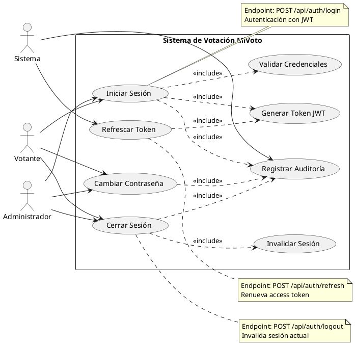

# CU-01: Autenticación de Usuario

## Diagrama de Caso de Uso



## Especificación Detallada

### CU-01.1: Iniciar Sesión

**ID**: CU-01.1
**Nombre**: Iniciar Sesión
**Actor Principal**: Votante, Administrador
**Precondiciones**:

- El usuario debe estar registrado en el sistema
- El usuario debe tener credenciales válidas
- El usuario debe estar activo

**Flujo Principal**:

1. El usuario accede al endpoint `/api/auth/login`
2. El usuario proporciona sus credenciales (username/email y contraseña)
3. El sistema valida las credenciales contra la base de datos
4. El sistema verifica que el usuario esté activo
5. El sistema genera un par de tokens JWT (access token y refresh token)
6. El sistema registra el evento de login en la auditoría
7. El sistema actualiza la fecha de último acceso del usuario
8. El sistema retorna los tokens y la información del usuario

**Flujo Alternativo 1: Credenciales Inválidas**

- 3a. Las credenciales no coinciden
  - 3a.1. El sistema incrementa el contador de intentos fallidos
  - 3a.2. El sistema registra el intento fallido en auditoría
  - 3a.3. El sistema retorna error 401 "Credenciales inválidas"
  - 3a.4. Fin del caso de uso

**Flujo Alternativo 2: Usuario Inactivo**

- 4a. El usuario está desactivado
  - 4a.1. El sistema registra el intento en auditoría
  - 4a.2. El sistema retorna error 403 "Usuario inactivo"
  - 4a.3. Fin del caso de uso

**Flujo Alternativo 3: Cuenta Bloqueada**

- 3b. El usuario ha excedido intentos de login
  - 3b.1. El sistema verifica el bloqueo temporal
  - 3b.2. El sistema retorna error 403 "Cuenta bloqueada temporalmente"
  - 3b.3. Fin del caso de uso

**Postcondiciones**:

- Se genera una sesión válida con tokens JWT
- Se registra el evento de login en auditoría
- Se actualiza la fecha de último acceso

**Datos de Entrada**:

```json
{
  "username": "string (email o documento)",
  "password": "string"
}
```

**Datos de Salida**:

```json
{
  "success": true,
  "message": "Login exitoso",
  "data": {
    "accessToken": "string (JWT)",
    "refreshToken": "string (JWT)",
    "tokenType": "Bearer",
    "expiresAt": "datetime",
    "user": {
      "id": "long",
      "documentNumber": "string",
      "firstName": "string",
      "lastName": "string",
      "email": "string",
      "role": "VOTER|ADMIN|SUPERVISOR",
      "active": "boolean",
      "lastLogin": "datetime"
    }
  },
  "timestamp": "datetime"
}
```

**Reglas de Negocio**:

- RN-01: La contraseña debe estar encriptada con BCrypt
- RN-02: El access token expira en 1 hora
- RN-03: El refresh token expira en 7 días
- RN-04: Máximo 5 intentos fallidos antes de bloqueo temporal (15 minutos)
- RN-05: Todos los eventos de autenticación deben ser auditados

---

### CU-01.2: Cerrar Sesión

**ID**: CU-01.2
**Nombre**: Cerrar Sesión
**Actor Principal**: Votante, Administrador
**Precondiciones**:

- El usuario debe tener una sesión activa
- El token JWT debe ser válido

**Flujo Principal**:

1. El usuario accede al endpoint `/api/auth/logout`
2. El sistema valida el token JWT del header Authorization
3. El sistema invalida la sesión actual (blacklist del token)
4. El sistema registra el evento de logout en auditoría
5. El sistema retorna confirmación de cierre de sesión

**Postcondiciones**:

- La sesión queda invalidada
- El token queda en blacklist (Redis)
- Se registra el evento en auditoría

**Datos de Entrada**:

- Header: `Authorization: Bearer {accessToken}`

**Datos de Salida**:

```json
{
  "success": true,
  "message": "Sesión cerrada exitosamente",
  "data": null,
  "timestamp": "datetime"
}
```

---

### CU-01.3: Refrescar Token

**ID**: CU-01.3
**Nombre**: Refrescar Token
**Actor Principal**: Sistema
**Precondiciones**:

- El refresh token debe ser válido
- El refresh token no debe estar expirado

**Flujo Principal**:

1. El cliente envía el refresh token al endpoint `/api/auth/refresh`
2. El sistema valida el refresh token
3. El sistema verifica que no esté en blacklist
4. El sistema genera un nuevo access token
5. El sistema retorna el nuevo access token

**Flujo Alternativo: Token Inválido o Expirado**

- 2a. El refresh token es inválido o está expirado
  - 2a.1. El sistema retorna error 401 "Token inválido"
  - 2a.2. El cliente debe realizar login nuevamente
  - 2a.3. Fin del caso de uso

**Postcondiciones**:

- Se genera un nuevo access token válido
- El refresh token permanece válido

**Datos de Entrada**:

```json
{
  "refreshToken": "string (JWT)"
}
```

**Datos de Salida**:

```json
{
  "success": true,
  "message": "Token refrescado exitosamente",
  "data": {
    "accessToken": "string (JWT)",
    "refreshToken": "string (JWT)",
    "tokenType": "Bearer",
    "expiresAt": "datetime"
  },
  "timestamp": "datetime"
}
```

---

### CU-01.4: Cambiar Contraseña

**ID**: CU-01.4
**Nombre**: Cambiar Contraseña
**Actor Principal**: Votante, Administrador
**Precondiciones**:

- El usuario debe estar autenticado
- El usuario debe conocer su contraseña actual

**Flujo Principal**:

1. El usuario accede al endpoint `/api/auth/change-password`
2. El usuario proporciona contraseña actual y nueva contraseña
3. El sistema valida la contraseña actual
4. El sistema valida que la nueva contraseña cumpla políticas de seguridad
5. El sistema encripta la nueva contraseña con BCrypt
6. El sistema actualiza la contraseña en la base de datos
7. El sistema invalida todas las sesiones activas del usuario
8. El sistema registra el cambio en auditoría
9. El sistema retorna confirmación

**Flujo Alternativo: Contraseña Actual Incorrecta**

- 3a. La contraseña actual no coincide
  - 3a.1. El sistema retorna error 400 "Contraseña actual incorrecta"
  - 3a.2. Fin del caso de uso

**Flujo Alternativo: Nueva Contraseña No Cumple Políticas**

- 4a. La nueva contraseña no cumple requisitos
  - 4a.1. El sistema retorna error 400 con detalles de políticas
  - 4a.2. Fin del caso de uso

**Postcondiciones**:

- La contraseña del usuario queda actualizada
- Todas las sesiones activas quedan invalidadas
- Se registra el evento en auditoría

**Datos de Entrada**:

```json
{
  "currentPassword": "string",
  "newPassword": "string",
  "confirmPassword": "string"
}
```

**Reglas de Negocio**:

- RN-06: La contraseña debe tener mínimo 8 caracteres
- RN-07: La contraseña debe contener al menos una mayúscula
- RN-08: La contraseña debe contener al menos un número
- RN-09: La contraseña debe contener al menos un carácter especial
- RN-10: La nueva contraseña no puede ser igual a las últimas 3 contraseñas
