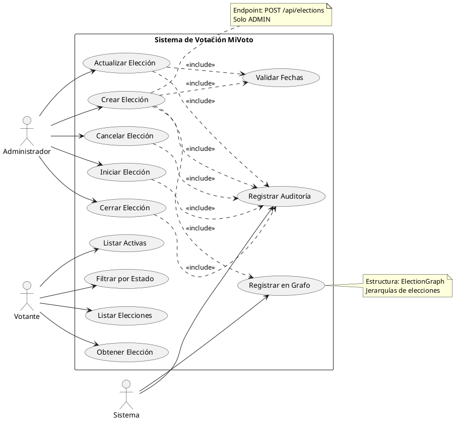

# CU-02: Gestión de Elecciones

## Diagrama de Caso de Uso



## Especificación Detallada

### CU-02.1: Crear Elección

**ID**: CU-02.1
**Nombre**: Crear Elección
**Actor Principal**: Administrador
**Precondiciones**:

- El usuario debe estar autenticado con rol ADMIN
- Las fechas deben ser válidas y coherentes

**Flujo Principal**:

1. El administrador accede al endpoint `/api/elections`
2. El administrador proporciona los datos de la elección
3. El sistema valida las fechas (inicio < fin)
4. El sistema valida que no exista una elección con el mismo nombre y fechas
5. El sistema crea la elección con estado SCHEDULED
6. El sistema registra la elección en ElectionGraph
7. El sistema registra el evento en auditoría
8. El sistema retorna la elección creada

**Datos de Entrada**:

```json
{
  "name": "string",
  "description": "string",
  "type": "PRESIDENTIAL|CONGRESSIONAL|REGIONAL|LOCAL",
  "startDate": "datetime",
  "endDate": "datetime",
  "districtId": "long (opcional)",
  "parentElectionId": "long (opcional)"
}
```

**Datos de Salida**:

```json
{
  "success": true,
  "message": "Elección creada exitosamente",
  "data": {
    "id": "long",
    "name": "string",
    "description": "string",
    "type": "string",
    "status": "SCHEDULED",
    "startDate": "datetime",
    "endDate": "datetime",
    "totalVotes": 0,
    "createdAt": "datetime"
  },
  "timestamp": "datetime"
}
```

**Reglas de Negocio**:

- RN-24: La fecha de inicio debe ser posterior a la fecha actual
- RN-25: La fecha de fin debe ser posterior a la fecha de inicio
- RN-26: El nombre de la elección debe ser único para el mismo período
- RN-27: Las elecciones se organizan en jerarquías mediante ElectionGraph

---

### CU-02.2: Iniciar Elección

**ID**: CU-02.2
**Nombre**: Iniciar Elección
**Actor Principal**: Administrador
**Precondiciones**:

- El usuario debe estar autenticado con rol ADMIN
- La elección debe estar en estado SCHEDULED
- Debe tener al menos 2 candidatos registrados

**Flujo Principal**:

1. El administrador accede al endpoint `/api/elections/{id}/start`
2. El sistema valida que la elección esté en estado SCHEDULED
3. El sistema verifica que tenga candidatos suficientes
4. El sistema cambia el estado a ACTIVE
5. El sistema registra el evento en auditoría
6. El sistema retorna confirmación

**Reglas de Negocio**:

- RN-28: Una elección debe tener mínimo 2 candidatos para iniciarse
- RN-29: Solo se puede iniciar elecciones en estado SCHEDULED

---

### CU-02.3: Cerrar Elección

**ID**: CU-02.3
**Nombre**: Cerrar Elección
**Actor Principal**: Administrador
**Precondiciones**:

- El usuario debe estar autenticado con rol ADMIN
- La elección debe estar en estado ACTIVE

**Flujo Principal**:

1. El administrador accede al endpoint `/api/elections/{id}/close`
2. El sistema valida que la elección esté en estado ACTIVE
3. El sistema cambia el estado a CLOSED
4. El sistema procesa los votos pendientes en VoteQueue
5. El sistema calcula los resultados finales
6. El sistema registra el evento en auditoría
7. El sistema retorna confirmación

**Reglas de Negocio**:

- RN-30: Solo se pueden cerrar elecciones en estado ACTIVE
- RN-31: Al cerrar, se procesan todos los votos pendientes
- RN-32: Los resultados quedan disponibles para consulta
