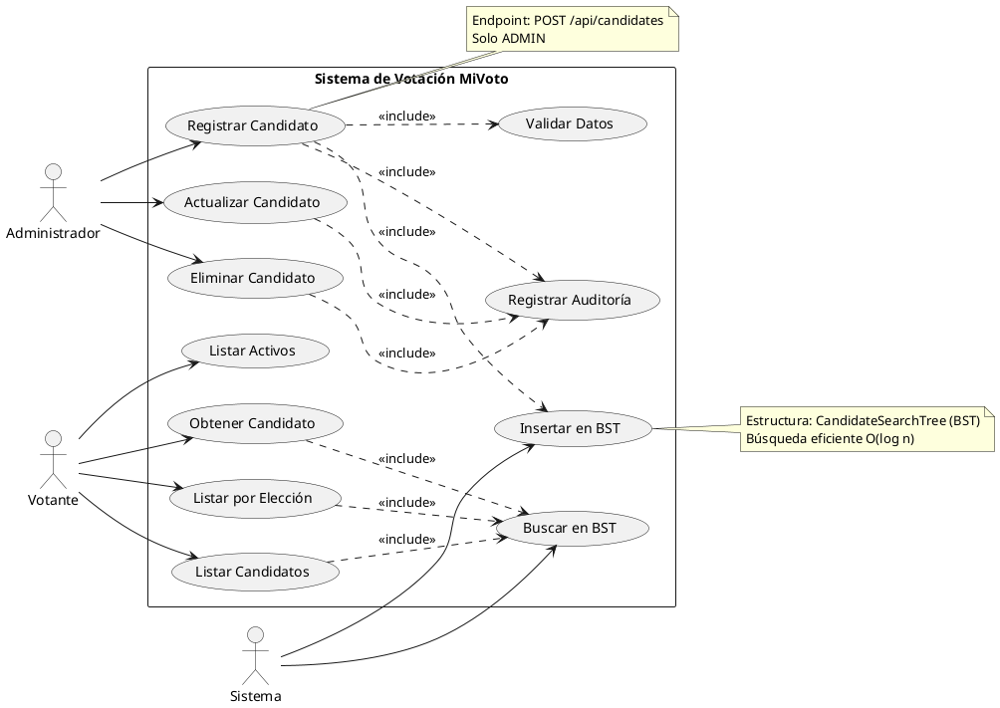

# CU-03: Gestión de Candidatos

## Diagrama de Caso de Uso



## Especificación Detallada

### CU-03.1: Registrar Candidato

**ID**: CU-03.1
**Nombre**: Registrar Candidato
**Actor Principal**: Administrador
**Precondiciones**:

- El usuario debe estar autenticado con rol ADMIN
- La elección debe existir
- La elección no debe estar en estado CLOSED o CANCELLED

**Flujo Principal**:

1. El administrador accede al endpoint `/api/candidates`
2. El administrador proporciona los datos del candidato
3. El sistema valida que la elección exista
4. El sistema valida que la elección no esté cerrada
5. El sistema valida que no exista un candidato con el mismo documento en la elección
6. El sistema crea el candidato con estado activo
7. El sistema inserta el candidato en CandidateSearchTree (BST)
8. El sistema registra el evento en auditoría
9. El sistema retorna el candidato creado

**Datos de Entrada**:

```json
{
  "electionId": "long",
  "documentNumber": "string",
  "firstName": "string",
  "lastName": "string",
  "politicalParty": "string",
  "photoUrl": "string (opcional)",
  "biography": "string (opcional)",
  "proposals": "string (opcional)"
}
```

**Datos de Salida**:

```json
{
  "success": true,
  "message": "Candidato registrado exitosamente",
  "data": {
    "id": "long",
    "documentNumber": "string",
    "fullName": "string",
    "politicalParty": "string",
    "photoUrl": "string",
    "electionId": "long",
    "electionName": "string",
    "active": true,
    "voteCount": 0,
    "createdAt": "datetime"
  },
  "timestamp": "datetime"
}
```

**Reglas de Negocio**:

- RN-33: Un candidato no puede estar registrado dos veces en la misma elección
- RN-34: Los candidatos se organizan en BST para búsqueda eficiente
- RN-35: No se pueden agregar candidatos a elecciones cerradas o canceladas
- RN-36: El documento del candidato debe ser único por elección

---

### CU-03.2: Listar Candidatos por Elección

**ID**: CU-03.2
**Nombre**: Listar Candidatos por Elección
**Actor Principal**: Votante
**Precondiciones**:

- La elección debe existir

**Flujo Principal**:

1. El usuario accede al endpoint `/api/candidates/election/{electionId}`
2. El sistema valida que la elección exista
3. El sistema busca los candidatos en CandidateSearchTree
4. El sistema retorna la lista de candidatos ordenados

**Datos de Salida**:

```json
{
  "success": true,
  "message": "Lista obtenida exitosamente",
  "data": [
    {
      "id": "long",
      "documentNumber": "string",
      "fullName": "string",
      "politicalParty": "string",
      "photoUrl": "string",
      "biography": "string",
      "proposals": "string",
      "active": true
    }
  ],
  "timestamp": "datetime"
}
```

**Estructuras de Datos Utilizadas**:

- **CandidateSearchTree**: Árbol BST para búsqueda eficiente de candidatos (O(log n))

---

### CU-03.3: Eliminar Candidato

**ID**: CU-03.3
**Nombre**: Eliminar Candidato
**Actor Principal**: Administrador
**Precondiciones**:

- El usuario debe estar autenticado con rol ADMIN
- El candidato no debe tener votos registrados

**Flujo Principal**:

1. El administrador accede al endpoint `/api/candidates/{id}`
2. El sistema valida que el candidato exista
3. El sistema verifica que no tenga votos
4. El sistema elimina el candidato del BST
5. El sistema elimina el candidato de la base de datos
6. El sistema registra el evento en auditoría
7. El sistema retorna confirmación

**Flujo Alternativo: Candidato con Votos**

- 3a. El candidato tiene votos registrados
  - 3a.1. El sistema retorna error 409 "El candidato tiene votos registrados"
  - 3a.2. Fin del caso de uso

**Reglas de Negocio**:

- RN-37: No se pueden eliminar candidatos con votos registrados
- RN-38: La eliminación debe reflejarse en el BST
