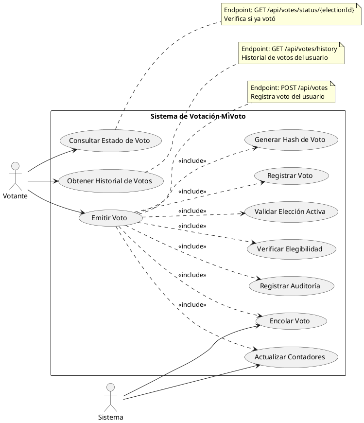

# CU-04: Emisión de Voto

## Diagrama de Caso de Uso



## Especificación Detallada

### CU-04.1: Emitir Voto

**ID**: CU-04.1
**Nombre**: Emitir Voto
**Actor Principal**: Votante
**Precondiciones**:

- El usuario debe estar autenticado con rol VOTER
- La elección debe estar en estado ACTIVE
- El usuario no debe haber votado previamente en esta elección
- El candidato debe pertenecer a la elección
- El candidato debe estar activo

**Flujo Principal**:

1. El votante accede al endpoint `/api/votes`
2. El votante proporciona el ID de la elección y el ID del candidato
3. El sistema valida que la elección esté activa
4. El sistema verifica que el usuario no haya votado en esta elección
5. El sistema valida que el candidato pertenezca a la elección
6. El sistema valida que el candidato esté activo
7. El sistema crea el registro de voto con timestamp
8. El sistema genera un hash SHA-256 único para el voto
9. El sistema encola el voto en la estructura VoteQueue (FIFO)
10. El sistema registra el voto en VoteRecordList (LinkedList)
11. El sistema incrementa el contador de votos del candidato
12. El sistema incrementa el contador de participación de la elección
13. El sistema registra el evento en auditoría
14. El sistema retorna confirmación con el hash del voto

**Flujo Alternativo 1: Elección No Activa**

- 3a. La elección no está en estado ACTIVE
  - 3a.1. El sistema retorna error 400 "La elección no está activa"
  - 3a.2. Fin del caso de uso

**Flujo Alternativo 2: Usuario Ya Votó**

- 4a. El usuario ya emitió un voto en esta elección
  - 4a.1. El sistema retorna error 409 "Ya ha votado en esta elección"
  - 4a.2. Fin del caso de uso

**Flujo Alternativo 3: Candidato Inválido**

- 5a. El candidato no pertenece a la elección
  - 5a.1. El sistema retorna error 400 "Candidato inválido para esta elección"
  - 5a.2. Fin del caso de uso

**Flujo Alternativo 4: Candidato Inactivo**

- 6a. El candidato está desactivado
  - 6a.1. El sistema retorna error 400 "Candidato no disponible"
  - 6a.2. Fin del caso de uso

**Postcondiciones**:

- Se registra el voto en la base de datos
- Se genera un hash único de verificación
- Se incrementan los contadores correspondientes
- Se registra el evento en auditoría
- El usuario no puede volver a votar en esta elección

**Datos de Entrada**:

```json
{
  "electionId": "long",
  "candidateId": "long"
}
```

**Datos de Salida**:

```json
{
  "success": true,
  "message": "Voto registrado exitosamente",
  "data": {
    "voteId": "long",
    "voteHash": "string (SHA-256)",
    "electionId": "long",
    "electionName": "string",
    "candidateId": "long",
    "candidateName": "string",
    "timestamp": "datetime",
    "verificationUrl": "string"
  },
  "timestamp": "datetime"
}
```

**Reglas de Negocio**:

- RN-11: Un usuario solo puede votar una vez por elección
- RN-12: El voto es anónimo (no se almacena relación directa usuario-candidato)
- RN-13: El hash del voto permite verificación sin revelar identidad
- RN-14: Los votos se procesan en orden FIFO mediante VoteQueue
- RN-15: Todos los votos deben ser auditados
- RN-16: El voto no puede ser modificado una vez emitido

**Estructuras de Datos Utilizadas**:

- **VoteQueue**: Cola FIFO para procesamiento de votos (O(1) enqueue/dequeue)
- **VoteRecordList**: Lista enlazada para registro cronológico (O(1) addFirst)

---

### CU-04.2: Consultar Estado de Voto

**ID**: CU-04.2
**Nombre**: Consultar Estado de Voto
**Actor Principal**: Votante
**Precondiciones**:

- El usuario debe estar autenticado
- La elección debe existir

**Flujo Principal**:

1. El votante accede al endpoint `/api/votes/status/{electionId}`
2. El sistema valida que la elección exista
3. El sistema consulta si el usuario tiene un voto registrado en la elección
4. El sistema retorna el estado (true si ya votó, false si no)

**Postcondiciones**:

- Se retorna el estado de votación del usuario

**Datos de Entrada**:

- Path parameter: `electionId` (long)

**Datos de Salida**:

```json
{
  "success": true,
  "message": "Estado obtenido exitosamente",
  "data": true,
  "timestamp": "datetime"
}
```

---

### CU-04.3: Obtener Historial de Votos

**ID**: CU-04.3
**Nombre**: Obtener Historial de Votos
**Actor Principal**: Votante
**Precondiciones**:

- El usuario debe estar autenticado

**Flujo Principal**:

1. El votante accede al endpoint `/api/votes/history`
2. El sistema consulta todos los votos del usuario autenticado
3. El sistema recupera información de cada voto desde VoteRecordList
4. El sistema retorna la lista de votos con detalles

**Postcondiciones**:

- Se retorna el historial completo de votos del usuario

**Datos de Salida**:

```json
{
  "success": true,
  "message": "Historial obtenido exitosamente",
  "data": [
    {
      "voteId": "long",
      "voteHash": "string",
      "electionId": "long",
      "electionName": "string",
      "electionType": "PRESIDENTIAL|CONGRESSIONAL|REGIONAL|LOCAL",
      "timestamp": "datetime",
      "verified": "boolean"
    }
  ],
  "timestamp": "datetime"
}
```

**Reglas de Negocio**:

- RN-17: El historial solo muestra que el usuario votó, no por quién votó
- RN-18: El historial se obtiene de VoteRecordList (orden cronológico)
