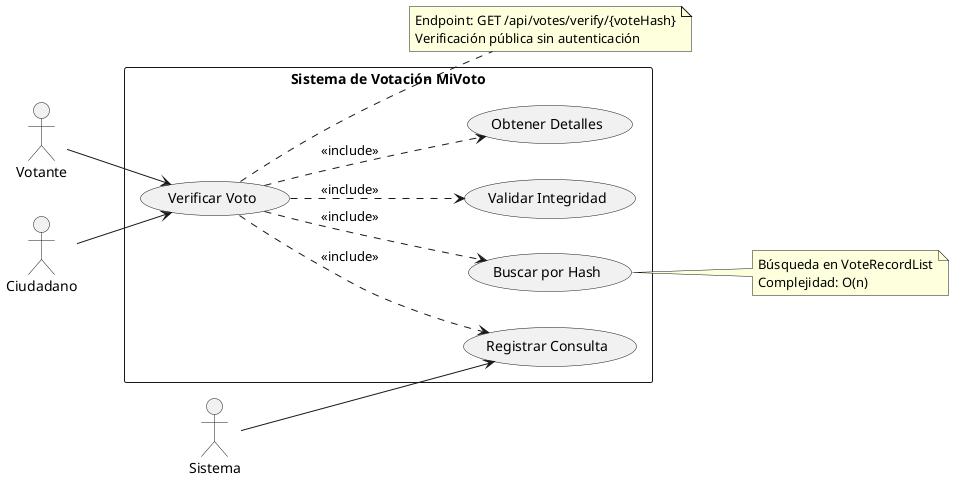

# CU-05: Verificación de Voto

## Diagrama de Caso de Uso



## Especificación Detallada

### CU-05.1: Verificar Voto

**ID**: CU-05.1
**Nombre**: Verificar Voto
**Actor Principal**: Votante, Ciudadano
**Precondiciones**:

- El hash del voto debe ser válido (formato SHA-256)

**Flujo Principal**:

1. El usuario accede al endpoint `/api/votes/verify/{voteHash}`
2. El sistema valida el formato del hash (64 caracteres hexadecimales)
3. El sistema busca el voto en VoteRecordList usando el hash
4. El sistema valida la integridad del voto
5. El sistema obtiene los detalles del voto (sin revelar identidad)
6. El sistema registra la consulta de verificación en auditoría
7. El sistema retorna los detalles del voto verificado

**Flujo Alternativo 1: Hash Inválido**

- 2a. El formato del hash no es válido
  - 2a.1. El sistema retorna error 400 "Formato de hash inválido"
  - 2a.2. Fin del caso de uso

**Flujo Alternativo 2: Voto No Encontrado**

- 3a. No existe un voto con ese hash
  - 3a.1. El sistema retorna error 404 "Voto no encontrado"
  - 3a.2. Fin del caso de uso

**Postcondiciones**:

- Se verifica la autenticidad del voto
- Se registra la consulta en auditoría
- No se revela la identidad del votante

**Datos de Entrada**:

- Path parameter: `voteHash` (string, patrón: `^[a-f0-9]{64}$`)

**Datos de Salida**:

```json
{
  "success": true,
  "message": "Voto verificado exitosamente",
  "data": {
    "voteHash": "string",
    "electionId": "long",
    "electionName": "string",
    "electionType": "PRESIDENTIAL|CONGRESSIONAL|REGIONAL|LOCAL",
    "timestamp": "datetime",
    "verified": true,
    "districtName": "string",
    "candidateId": "long (opcional, según configuración de privacidad)",
    "candidateName": "string (opcional)"
  },
  "timestamp": "datetime"
}
```

**Reglas de Negocio**:

- RN-19: La verificación es pública (no requiere autenticación)
- RN-20: El hash es único e inmutable
- RN-21: La verificación no debe revelar la identidad del votante
- RN-22: Todas las verificaciones deben ser auditadas
- RN-23: El sistema puede configurar si muestra o no el candidato votado

**Estructuras de Datos Utilizadas**:

- **VoteRecordList**: Lista enlazada para búsqueda de votos por hash

**Consideraciones de Seguridad**:

- El hash SHA-256 garantiza integridad
- No se expone información sensible del votante
- Se auditan todas las consultas de verificación
- Rate limiting aplicado para prevenir ataques de fuerza bruta
