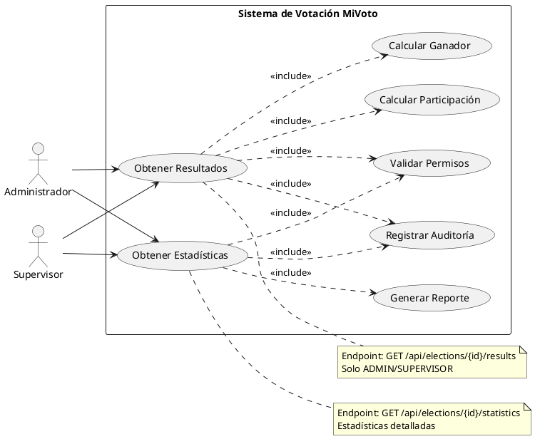

# CU-06: Consulta de Resultados

## Diagrama de Caso de Uso



## Especificación Detallada

### CU-06.1: Obtener Resultados

**ID**: CU-06.1
**Nombre**: Obtener Resultados de Elección
**Actor Principal**: Administrador, Supervisor
**Precondiciones**:

- El usuario debe estar autenticado con rol ADMIN o SUPERVISOR
- La elección debe existir

**Flujo Principal**:

1. El usuario accede al endpoint `/api/elections/{id}/results`
2. El sistema valida los permisos del usuario
3. El sistema valida que la elección exista
4. El sistema obtiene todos los candidatos de la elección
5. El sistema calcula el total de votos por candidato
6. El sistema calcula el porcentaje de cada candidato
7. El sistema determina el ganador
8. El sistema calcula la participación total
9. El sistema registra la consulta en auditoría
10. El sistema retorna los resultados

**Datos de Salida**:

```json
{
  "success": true,
  "message": "Resultados obtenidos exitosamente",
  "data": {
    "electionId": "long",
    "electionName": "string",
    "electionType": "string",
    "status": "string",
    "totalVotes": "long",
    "totalEligibleVoters": "long",
    "participationRate": "double",
    "results": [
      {
        "candidateId": "long",
        "candidateName": "string",
        "politicalParty": "string",
        "voteCount": "long",
        "percentage": "double",
        "position": "integer"
      }
    ],
    "winner": {
      "candidateId": "long",
      "candidateName": "string",
      "voteCount": "long",
      "percentage": "double"
    },
    "generatedAt": "datetime"
  },
  "timestamp": "datetime"
}
```

**Reglas de Negocio**:

- RN-39: Solo ADMIN y SUPERVISOR pueden consultar resultados
- RN-40: Los resultados se ordenan por cantidad de votos (descendente)
- RN-41: El ganador es el candidato con más votos
- RN-42: Todas las consultas de resultados deben ser auditadas

---

### CU-06.2: Obtener Estadísticas

**ID**: CU-06.2
**Nombre**: Obtener Estadísticas de Elección
**Actor Principal**: Administrador, Supervisor
**Precondiciones**:

- El usuario debe estar autenticado con rol ADMIN o SUPERVISOR
- La elección debe existir

**Flujo Principal**:

1. El usuario accede al endpoint `/api/elections/{id}/statistics`
2. El sistema valida los permisos del usuario
3. El sistema calcula estadísticas detalladas
4. El sistema genera métricas de participación
5. El sistema registra la consulta en auditoría
6. El sistema retorna las estadísticas

**Datos de Salida**:

```json
{
  "success": true,
  "message": "Estadísticas obtenidas exitosamente",
  "data": {
    "electionId": "long",
    "totalVotes": "long",
    "totalCandidates": "integer",
    "participationRate": "double",
    "votesPerHour": "double",
    "peakVotingTime": "datetime",
    "districtStatistics": [
      {
        "districtName": "string",
        "totalVotes": "long",
        "participationRate": "double"
      }
    ],
    "timeSeriesData": [
      {
        "timestamp": "datetime",
        "cumulativeVotes": "long"
      }
    ]
  },
  "timestamp": "datetime"
}
```

**Reglas de Negocio**:

- RN-43: Las estadísticas incluyen métricas de participación
- RN-44: Se generan datos de series temporales para análisis
