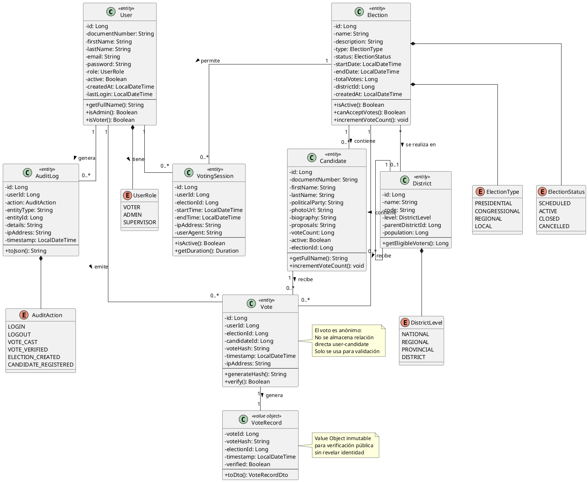

# DC-01: Modelo de Dominio

## Diagrama de Clases

## Descripción del Modelo

### Entidades Principales

#### User (Usuario)

- **Propósito**: Representa a los usuarios del sistema
- **Roles**: VOTER (votante), ADMIN (administrador), SUPERVISOR
- **Características**:
  - Autenticación con email/documento y contraseña
  - Control de estado activo/inactivo
  - Registro de último acceso

#### Election (Elección)

- **Propósito**: Representa un proceso electoral
- **Estados**: SCHEDULED, ACTIVE, CLOSED, CANCELLED
- **Tipos**: PRESIDENTIAL, CONGRESSIONAL, REGIONAL, LOCAL
- **Características**:
  - Control de fechas de inicio y fin
  - Contador de votos totales
  - Asociación con distrito

#### Candidate (Candidato)

- **Propósito**: Representa a un candidato en una elección
- **Características**:
  - Información personal y política
  - Contador de votos recibidos
  - Estado activo/inactivo
  - Asociación con elección

#### Vote (Voto)

- **Propósito**: Registro de un voto emitido
- **Características**:
  - Hash SHA-256 para verificación
  - Timestamp de emisión
  - Anonimato garantizado
  - Trazabilidad de IP

#### VoteRecord (Registro de Voto)

- **Propósito**: Value Object para verificación pública
- **Características**:
  - Inmutable
  - No revela identidad del votante
  - Permite verificación de integridad

#### VotingSession (Sesión de Votación)

- **Propósito**: Rastrea sesiones de votación
- **Características**:
  - Control de tiempo de sesión
  - Información de navegador y IP
  - Detección de anomalías

#### District (Distrito)

- **Propósito**: Organización territorial
- **Niveles**: NATIONAL, REGIONAL, PROVINCIAL, DISTRICT
- **Características**:
  - Jerarquía de distritos
  - Población y votantes elegibles

#### AuditLog (Registro de Auditoría)

- **Propósito**: Trazabilidad completa del sistema
- **Acciones**: LOGIN, LOGOUT, VOTE_CAST, VOTE_VERIFIED, etc.
- **Características**:
  - Registro inmutable
  - Información completa de contexto

### Relaciones

**User - Vote**: Un usuario puede emitir múltiples votos (en diferentes elecciones)

**Election - Candidate**: Una elección contiene múltiples candidatos

**Election - Vote**: Una elección recibe múltiples votos

**Candidate - Vote**: Un candidato recibe múltiples votos

**Vote - VoteRecord**: Cada voto genera un registro de verificación

**District - District**: Jerarquía de distritos (auto-referencia)

### Reglas de Integridad

1. **Unicidad de Voto**: Un usuario solo puede votar una vez por elección
2. **Anonimato**: No se almacena relación directa user-candidate
3. **Inmutabilidad**: Los votos no pueden ser modificados una vez emitidos
4. **Verificabilidad**: Todo voto genera un hash único para verificación
5. **Auditoría**: Todas las acciones críticas se registran en AuditLog

### Consideraciones de Diseño

- **Separación de Concerns**: Entidades de dominio puras sin dependencias de infraestructura
- **Value Objects**: VoteRecord es inmutable y sin identidad propia
- **Enumeraciones**: Tipos y estados bien definidos
- **Auditoría**: Sistema completo de trazabilidad
- **Privacidad**: Diseño que garantiza anonimato del voto
