# DC-02: Arquitectura Hexagonal

## Diagrama de Clases

```plantuml
@startuml
skinparam packageStyle rectangle
skinparam linetype ortho

package "Domain Layer" {
    interface VoteRepositoryPort <<port>> {
        + save(vote: Vote): Vote
        + findById(id: Long): Optional<Vote>
    }

    interface ElectionRepositoryPort <<port>> {
        + save(election: Election): Election
        + findActive(): List<Election>
    }

    class Vote <<entity>>
    class Election <<entity>>

    VoteRepositoryPort ..> Vote
    ElectionRepositoryPort ..> Election
}

package "Application Layer" {
    interface VoteUseCase <<port>> {
        + castVote(command: VoteCommand): VoteResponse
    }

    class VoteService <<service>> {
        - voteRepository: VoteRepositoryPort
        - electionRepository: ElectionRepositoryPort
        + castVote(command: VoteCommand): VoteResponse
    }

    VoteService ..|> VoteUseCase
    VoteService --> VoteRepositoryPort
    VoteService --> ElectionRepositoryPort
}

package "Infrastructure Layer" {
    package "Persistence Adapter" {
        class JpaVoteRepository <<adapter>> {
            - jpaRepository: SpringDataVoteRepository
            + save(vote: Vote): Vote
        }

        class JpaElectionRepository <<adapter>> {
            - jpaRepository: SpringDataElectionRepository
            + save(election: Election): Election
        }
    }

    package "Security Adapter" {
        class JwtTokenProvider <<adapter>>
        class SecurityConfig <<config>>
    }

    package "REST Adapter" {
        class VoteController <<adapter>> {
            - voteUseCase: VoteUseCase
            + castVote(request: VoteRequest): ResponseEntity
        }
    }
}

' Relaciones entre capas
JpaVoteRepository ..|> VoteRepositoryPort
JpaElectionRepository ..|> ElectionRepositoryPort

VoteController --> VoteUseCase

note right of VoteUseCase
  Input Port (Driver Port)
  Define la API pública de la aplicación
end note

note right of VoteRepositoryPort
  Output Port (Driven Port)
  Define la interfaz para persistencia
end note

note right of JpaVoteRepository
  Adapter (Driven Adapter)
  Implementa la persistencia usando JPA
end note

note right of VoteController
  Adapter (Driver Adapter)
  Expone la funcionalidad vía REST
end note

@enduml
```

## Descripción de la Arquitectura

### Domain Layer (Núcleo)

Esta capa contiene la lógica de negocio pura y las entidades del dominio. No tiene dependencias externas.

- **Entidades**: `Vote`, `Election`, `Candidate`
- **Output Ports**: `VoteRepositoryPort`, `ElectionRepositoryPort` (Interfaces que definen cómo el dominio necesita interactuar con el exterior, ej. bases de datos)

### Application Layer (Orquestación)

Esta capa orquesta los casos de uso utilizando las entidades del dominio y los puertos.

- **Input Ports**: `VoteUseCase` (Interfaces que definen lo que el sistema puede hacer)
- **Servicios**: `VoteService` (Implementación de los casos de uso)
- **Dependencias**: Solo depende de la capa de Dominio.

### Infrastructure Layer (Adaptadores)

Esta capa implementa las interfaces definidas en el dominio y la aplicación, conectando el sistema con tecnologías externas.

- **Persistence Adapters**: Implementaciones de Repositorios usando Spring Data JPA (`JpaVoteRepository`).
- **REST Adapters**: Controladores REST que manejan las peticiones HTTP (`VoteController`).
- **Security Adapters**: Configuración de seguridad y JWT.

### Principio de Inversión de Dependencias

La arquitectura sigue estrictamente la Regla de Dependencia: **las dependencias solo apuntan hacia adentro**.

- La capa de Infraestructura depende de la capa de Aplicación y Dominio.
- La capa de Aplicación depende de la capa de Dominio.
- La capa de Dominio no depende de nadie.

Esto permite cambiar la base de datos, el framework web o cualquier detalle de infraestructura sin afectar la lógica de negocio.
