# DC-03: Estructuras de Datos Personalizadas

## Diagrama de Clases

```plantuml
@startuml
skinparam classAttributeIconSize 0

package "Estructuras Lineales" {
    interface MyList<T> {
        + addFirst(element: T): void
        + addLast(element: T): void
        + removeFirst(): T
        + get(index: int): T
        + size(): int
        + isEmpty(): boolean
    }

    class Node<T> {
        - data: T
        - next: Node<T>
        - prev: Node<T>
    }

    class VoteRecordList {
        - head: Node<VoteRecord>
        - tail: Node<VoteRecord>
        - size: int
        --
        + addFirst(record: VoteRecord): void
        + findByHash(hash: String): VoteRecord
        + getAll(): List<VoteRecord>
    }

    class VoteQueue {
        - front: Node<Vote>
        - rear: Node<Vote>
        - size: int
        --
        + enqueue(vote: Vote): void
        + dequeue(): Vote
        + peek(): Vote
        + isEmpty(): boolean
    }

    VoteRecordList ..|> MyList
    VoteRecordList *-- Node
    VoteQueue *-- Node
}

package "Estructuras No Lineales" {
    class TreeNode<T> {
        - data: T
        - left: TreeNode<T>
        - right: TreeNode<T>
        - height: int
    }

    class CandidateSearchTree {
        - root: TreeNode<Candidate>
        --
        + insert(candidate: Candidate): void
        + findById(id: Long): Candidate
        + delete(id: Long): void
        + getInOrder(): List<Candidate>
        - balance(node: TreeNode): TreeNode
    }

    class GraphNode<T> {
        - data: T
        - neighbors: List<GraphNode<T>>
    }

    class ElectionGraph {
        - nodes: Map<Long, GraphNode<Election>>
        --
        + addVertex(election: Election): void
        + addEdge(parentId: Long, childId: Long): void
        + getChildren(parentId: Long): List<Election>
        + getPath(startId: Long, endId: Long): List<Election>
    }

    CandidateSearchTree *-- TreeNode
    ElectionGraph *-- GraphNode
}

note bottom of VoteRecordList
  Lista Doblemente Enlazada
  Optimizada para inserción rápida O(1)
  y recorrido secuencial
end note

note bottom of VoteQueue
  Cola FIFO (First-In-First-Out)
  Usada para procesar votos en orden
  de llegada. Enqueue/Dequeue O(1)
end note

note bottom of CandidateSearchTree
  Árbol Binario de Búsqueda (BST)
  Optimizado para búsqueda de candidatos
  Complejidad promedio O(log n)
end note

note bottom of ElectionGraph
  Grafo Dirigido
  Modela jerarquías de elecciones
  (Nacional -> Regional -> Local)
end note

@enduml
```

## Descripción de Estructuras

### 1. VoteRecordList (Lista Enlazada)

Implementación personalizada de una lista doblemente enlazada.

- **Uso Principal**: Almacenar el historial de votos (`VoteRecord`) para auditoría y verificación.
- **Ventaja**: Inserción en cabeza (`addFirst`) es O(1), ideal para logs cronológicos inversos.

### 2. VoteQueue (Cola)

Implementación personalizada de una cola FIFO mediante nodos enlazados.

- **Uso Principal**: Buffer de procesamiento de votos. Los votos entran y se procesan en orden estricto de llegada.
- **Ventaja**: Operaciones `enqueue` y `dequeue` son O(1) constantes.

### 3. CandidateSearchTree (BST)

Implementación de un Árbol Binario de Búsqueda (posiblemente AVL para balanceo).

- **Uso Principal**: Organización de candidatos dentro de una elección para búsquedas rápidas por ID.
- **Ventaja**: Búsqueda, inserción y eliminación en O(log n).

### 4. ElectionGraph (Grafo)

Implementación de un grafo dirigido usando lista de adyacencia.

- **Uso Principal**: Modelar la relación jerárquica entre elecciones (ej. una elección presidencial "contiene" elecciones regionales).
- **Ventaja**: Permite algoritmos de recorrido (BFS/DFS) para encontrar elecciones relacionadas o agregar resultados jerárquicos.
