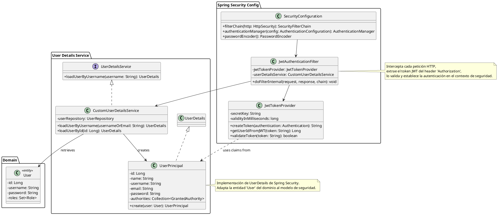

# DC-04: Seguridad y Autenticación

## Diagrama de Clases

## Descripción de Componentes de Seguridad

### SecurityConfiguration

Clase de configuración principal de Spring Security. Define:

- Cadena de filtros de seguridad.
- Reglas de autorización por endpoint (quién puede acceder a qué).
- Configuración de manejo de sesiones (stateless para REST).
- Bean de encriptación de contraseñas (BCrypt).

### JwtAuthenticationFilter

Filtro personalizado que se ejecuta una vez por petición (`OncePerRequestFilter`).

1. Obtiene el token JWT del header.
2. Valida la firma y expiración del token usando `JwtTokenProvider`.
3. Si es válido, carga los detalles del usuario y lo autentica en `SecurityContextHolder`.

### JwtTokenProvider

Componente utilitario encargado de:

- Generar tokens JWT firmados con una clave secreta (HMAC SHA-256).
- Extraer claims (datos) como userId del token.
- Validar la integridad y vigencia del token.

### CustomUserDetailsService

Servicio que implementa la interfaz estándar de Spring Security `UserDetailsService`.

- Su única responsabilidad es cargar los datos del usuario desde la base de datos (`UserRepository`) y devolver una implementación de `UserDetails`.

### UserPrincipal

Adaptador (Adapter Pattern) que convierte nuestra entidad de dominio `User` en un objeto `UserDetails` que Spring Security entiende.

- Contiene los datos necesarios para autenticación y autorización (password, roles/authorities).
- Implementa `isEnabled`, `isAccountNonLocked`, etc., basándose en el estado del usuario.
