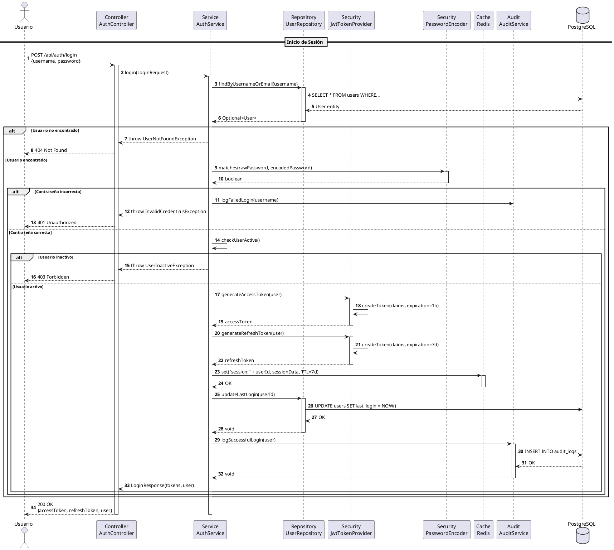

# DS-01: Autenticación JWT

## Diagrama de Secuencia



## Descripción del Flujo

### Actores y Componentes

- **Usuario**: Actor que inicia sesión
- **AuthController**: Controlador REST que recibe la petición
- **AuthService**: Servicio de aplicación que orquesta la lógica
- **UserRepository**: Repositorio de acceso a datos de usuarios
- **JwtTokenProvider**: Proveedor de tokens JWT
- **PasswordEncoder**: Codificador de contraseñas (BCrypt)
- **Redis**: Cache para sesiones y blacklist
- **AuditService**: Servicio de auditoría
- **PostgreSQL**: Base de datos principal

### Pasos del Flujo

1. **Recepción de Credenciales**: El usuario envía username y password
2. **Búsqueda de Usuario**: Se busca el usuario por username o email
3. **Validación de Existencia**: Si no existe, retorna 404
4. **Validación de Contraseña**: Se compara con BCrypt
5. **Registro de Intento Fallido**: Si falla, se audita y retorna 401
6. **Validación de Estado**: Se verifica que el usuario esté activo
7. **Generación de Access Token**: JWT con expiración de 1 hora
8. **Generación de Refresh Token**: JWT con expiración de 7 días
9. **Almacenamiento en Redis**: Se guarda la sesión en cache
10. **Actualización de Último Acceso**: Se actualiza last_login en BD
11. **Registro de Auditoría**: Se registra el login exitoso
12. **Respuesta al Usuario**: Se retornan los tokens y datos del usuario

### Consideraciones de Seguridad

- Las contraseñas se almacenan con BCrypt (factor 12)
- Los tokens JWT están firmados con HS256
- Las sesiones se almacenan en Redis con TTL
- Todos los eventos se auditan en PostgreSQL
- Rate limiting aplicado en el controller

### Estructuras de Datos

**Claims del JWT**:

```json
{
  "sub": "userId",
  "username": "string",
  "role": "VOTER|ADMIN|SUPERVISOR",
  "iat": "timestamp",
  "exp": "timestamp"
}
```

**Sesión en Redis**:

```json
{
  "userId": "long",
  "username": "string",
  "role": "string",
  "loginTime": "datetime",
  "lastActivity": "datetime"
}
```
