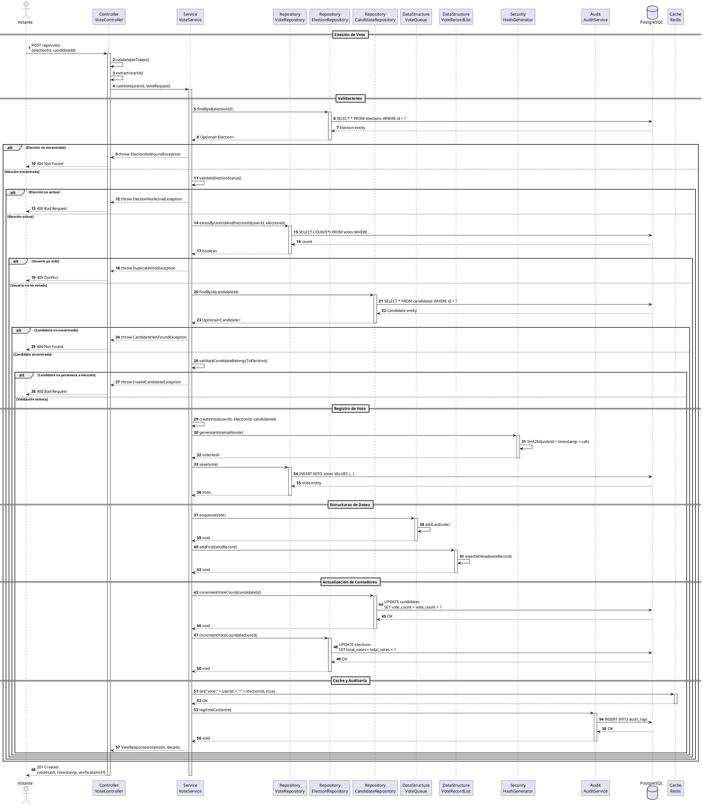

# DS-02: Emisión de Voto

## Diagrama de Secuencia

## Descripción del Flujo

### Actores y Componentes

- **Votante**: Usuario autenticado con rol VOTER
- **VoteController**: Controlador REST para votación
- **VoteService**: Servicio de aplicación que orquesta el voto
- **VoteRepository**: Repositorio de votos
- **ElectionRepository**: Repositorio de elecciones
- **CandidateRepository**: Repositorio de candidatos
- **VoteQueue**: Cola FIFO para procesamiento de votos
- **VoteRecordList**: Lista enlazada para registro cronológico
- **HashGenerator**: Generador de hash SHA-256
- **AuditService**: Servicio de auditoría
- **PostgreSQL**: Base de datos principal
- **Redis**: Cache para optimización

### Pasos del Flujo

1. **Autenticación**: Validación del token JWT
2. **Validación de Elección**: Verifica que exista y esté activa
3. **Verificación de Voto Duplicado**: Consulta si ya votó
4. **Validación de Candidato**: Verifica existencia y pertenencia
5. **Creación de Voto**: Genera el registro de voto
6. **Generación de Hash**: Crea hash SHA-256 único
7. **Persistencia**: Guarda en PostgreSQL
8. **Encolado**: Agrega a VoteQueue (FIFO)
9. **Registro Cronológico**: Inserta en VoteRecordList
10. **Actualización de Contadores**: Incrementa votos del candidato y elección
11. **Cache**: Marca en Redis que el usuario votó
12. **Auditoría**: Registra el evento
13. **Respuesta**: Retorna hash de verificación

### Estructuras de Datos Utilizadas

**VoteQueue (Cola FIFO)**:

- Operación: `enqueue(vote)` - O(1)
- Propósito: Procesamiento ordenado de votos
- Implementación: Cola con nodos enlazados

**VoteRecordList (Lista Enlazada)**:

- Operación: `addFirst(voteRecord)` - O(1)
- Propósito: Registro cronológico inverso
- Implementación: Lista doblemente enlazada

### Reglas de Negocio Aplicadas

- RN-11: Un usuario solo puede votar una vez por elección
- RN-12: El voto es anónimo
- RN-13: El hash permite verificación sin revelar identidad
- RN-14: Procesamiento FIFO mediante VoteQueue
- RN-15: Todos los votos son auditados

### Consideraciones de Seguridad

- Token JWT validado en cada petición
- Hash SHA-256 con salt para unicidad
- Voto anónimo (no se almacena relación directa)
- Auditoría completa de eventos
- Cache en Redis para prevenir votos duplicados
