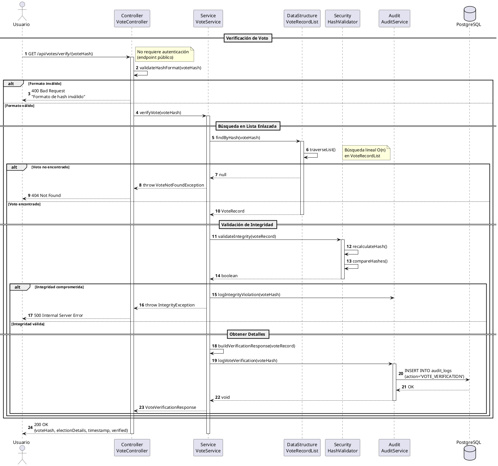

# DS-03: Verificación de Voto

## Diagrama de Secuencia



## Descripción del Flujo

### Actores y Componentes

- **Usuario**: Cualquier persona (no requiere autenticación)
- **VoteController**: Controlador REST para verificación
- **VoteService**: Servicio de verificación de votos
- **VoteRecordList**: Lista enlazada con registros de votos
- **HashValidator**: Validador de integridad de hash
- **AuditService**: Servicio de auditoría
- **PostgreSQL**: Base de datos para auditoría

### Pasos del Flujo

1. **Recepción de Hash**: Usuario proporciona hash del voto
2. **Validación de Formato**: Verifica patrón hexadecimal de 64 caracteres
3. **Búsqueda en VoteRecordList**: Recorre la lista enlazada
4. **Validación de Integridad**: Recalcula hash y compara
5. **Registro de Auditoría**: Registra la verificación
6. **Respuesta**: Retorna detalles del voto verificado

### Estructura de Datos Utilizada

**VoteRecordList (Lista Enlazada)**:

```
[Head] -> [VoteRecord] -> [VoteRecord] -> [VoteRecord] -> null
          hash: abc123    hash: def456    hash: ghi789
          timestamp       timestamp       timestamp
          electionId      electionId      electionId
```

- **Operación**: `findByHash(hash)` - O(n)
- **Propósito**: Búsqueda de votos por hash
- **Implementación**: Recorrido secuencial desde head

### Validación de Integridad

El hash se recalcula usando:

```
SHA256(voteId + timestamp + electionId + salt)
```

Si el hash recalculado coincide con el almacenado, el voto es íntegro.

### Reglas de Negocio Aplicadas

- RN-19: Verificación pública (sin autenticación)
- RN-20: Hash único e inmutable
- RN-21: No revela identidad del votante
- RN-22: Todas las verificaciones son auditadas

### Consideraciones de Privacidad

- No se expone información del votante
- Solo se muestra: elección, timestamp, hash
- Opcionalmente se puede mostrar el candidato (configurable)
