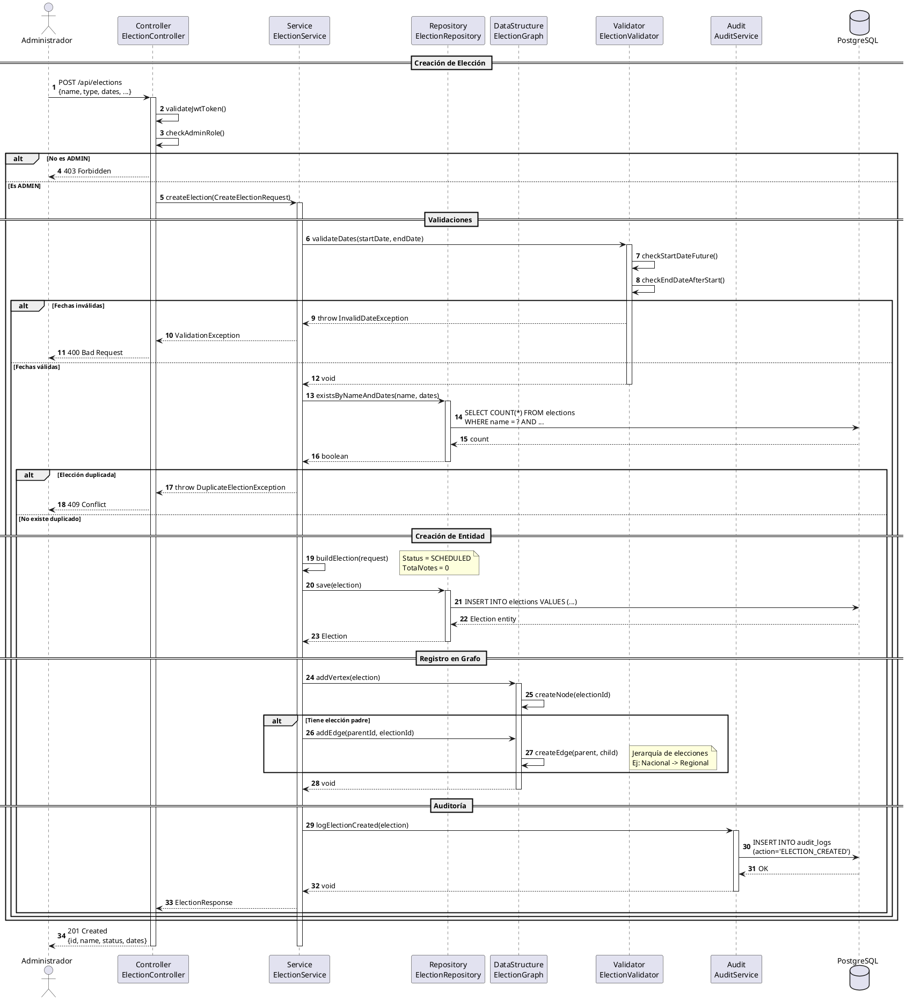

# DS-04: Creación de Elección

## Diagrama de Secuencia



## Descripción del Flujo

### Actores y Componentes

- **Administrador**: Usuario con rol ADMIN
- **ElectionController**: Controlador REST para elecciones
- **ElectionService**: Servicio de gestión de elecciones
- **ElectionRepository**: Repositorio de elecciones
- **ElectionGraph**: Grafo para jerarquías de elecciones
- **ElectionValidator**: Validador de reglas de negocio
- **AuditService**: Servicio de auditoría
- **PostgreSQL**: Base de datos principal

### Pasos del Flujo

1. **Autenticación y Autorización**: Valida JWT y rol ADMIN
2. **Validación de Fechas**: Verifica coherencia temporal
3. **Verificación de Duplicados**: Consulta elecciones existentes
4. **Creación de Entidad**: Construye objeto Election
5. **Persistencia**: Guarda en PostgreSQL
6. **Registro en Grafo**: Agrega vértice y aristas
7. **Auditoría**: Registra el evento
8. **Respuesta**: Retorna elección creada

### Estructura de Datos Utilizada

**ElectionGraph (Grafo Dirigido)**:

```
         [Elección Nacional]
                |
        +-------+-------+
        |               |
   [Regional A]    [Regional B]
        |               |
    +---+---+       +---+---+
    |       |       |       |
 [Local1][Local2][Local3][Local4]
```

- **Vértices**: Elecciones
- **Aristas**: Relaciones jerárquicas (padre -> hijo)
- **Operaciones**:
  - `addVertex(election)` - O(1)
  - `addEdge(parent, child)` - O(1)
  - `getChildren(electionId)` - O(V+E)

### Validaciones Aplicadas

**Fechas**:

- startDate > NOW()
- endDate > startDate
- Duración mínima: 1 hora
- Duración máxima: 30 días

**Duplicados**:

- Nombre único en el mismo período
- No solapamiento de fechas para mismo tipo y distrito

### Reglas de Negocio Aplicadas

- RN-24: Fecha de inicio posterior a fecha actual
- RN-25: Fecha de fin posterior a fecha de inicio
- RN-26: Nombre único para el mismo período
- RN-27: Jerarquías mediante ElectionGraph

### Jerarquías de Elecciones

El grafo permite modelar:

- **Elecciones Nacionales** → **Regionales** → **Locales**
- **Elecciones Generales** → **Elecciones Específicas**
- Consultas de elecciones relacionadas
- Validación de dependencias
