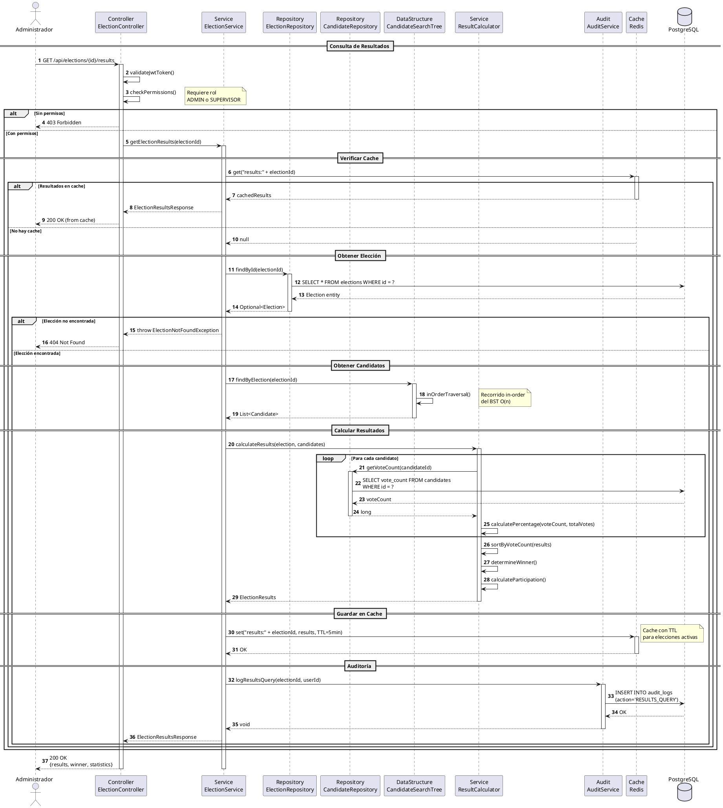

# DS-05: Consulta de Resultados

## Diagrama de Secuencia



## Descripción del Flujo

### Actores y Componentes

- **Administrador**: Usuario con rol ADMIN o SUPERVISOR
- **ElectionController**: Controlador REST para elecciones
- **ElectionService**: Servicio de gestión de elecciones
- **ElectionRepository**: Repositorio de elecciones
- **CandidateRepository**: Repositorio de candidatos
- **CandidateSearchTree**: BST para búsqueda de candidatos
- **ResultCalculator**: Calculador de resultados
- **AuditService**: Servicio de auditoría
- **Redis**: Cache para optimización
- **PostgreSQL**: Base de datos principal

### Pasos del Flujo

1. **Autenticación y Autorización**: Valida JWT y permisos
2. **Verificación de Cache**: Consulta Redis
3. **Obtención de Elección**: Busca en PostgreSQL
4. **Búsqueda de Candidatos**: Recorre BST in-order
5. **Cálculo de Resultados**: Procesa votos y porcentajes
6. **Ordenamiento**: Ordena por cantidad de votos
7. **Determinación de Ganador**: Identifica al candidato con más votos
8. **Almacenamiento en Cache**: Guarda en Redis con TTL
9. **Auditoría**: Registra la consulta
10. **Respuesta**: Retorna resultados completos

### Estructura de Datos Utilizada

**CandidateSearchTree (BST)**:

```
           [Candidato C]
          /             \
    [Candidato A]    [Candidato E]
         \               /
      [Candidato B] [Candidato D]
```

- **Operación**: `inOrderTraversal()` - O(n)
- **Propósito**: Obtener candidatos ordenados
- **Resultado**: Lista ordenada por criterio (ej: ID, nombre)

### Cálculo de Resultados

**Métricas Calculadas**:

```java
percentage = (voteCount / totalVotes) * 100
participationRate = (totalVotes / eligibleVoters) * 100
winner = candidate with max(voteCount)
```

**Ordenamiento**:

- Por cantidad de votos (descendente)
- Empates se resuelven por timestamp de último voto

### Optimización con Cache

**Estrategia de Cache**:

- **Key**: `results:{electionId}`
- **TTL**:
  - Elecciones activas: 5 minutos
  - Elecciones cerradas: 24 horas
- **Invalidación**: Al registrar nuevo voto

### Reglas de Negocio Aplicadas

- RN-39: Solo ADMIN y SUPERVISOR pueden consultar resultados
- RN-40: Resultados ordenados por votos (descendente)
- RN-41: Ganador es el candidato con más votos
- RN-42: Todas las consultas son auditadas

### Respuesta de Resultados

```json
{
  "electionId": 1,
  "electionName": "Elecciones Presidenciales 2025",
  "status": "CLOSED",
  "totalVotes": 15000,
  "totalEligibleVoters": 20000,
  "participationRate": 75.0,
  "results": [
    {
      "candidateId": 5,
      "candidateName": "Juan Pérez",
      "politicalParty": "Partido A",
      "voteCount": 8000,
      "percentage": 53.33,
      "position": 1
    },
    {
      "candidateId": 3,
      "candidateName": "María García",
      "politicalParty": "Partido B",
      "voteCount": 7000,
      "percentage": 46.67,
      "position": 2
    }
  ],
  "winner": {
    "candidateId": 5,
    "candidateName": "Juan Pérez",
    "voteCount": 8000,
    "percentage": 53.33
  }
}
```
